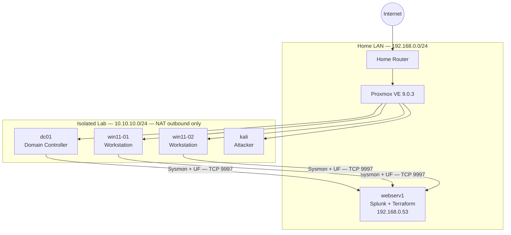

# SOC Detection Lab

A self-hosted detection engineering lab built on Proxmox VE, designed to demonstrate end-to-end threat detection across five MITRE ATT&CK techniques. Windows endpoints ship Sysmon telemetry to Splunk via Universal Forwarder; each technique has a full writeup covering attack simulation, detection logic, and response guidance.

Built as a portfolio project for SOC/detection engineering roles.

## Architecture at a glance



### VM inventory

| Hostname | Role | OS | Specs |
|---|---|---|---|
| dc01 | Domain Controller, DNS, DHCP | Windows Server 2022 | 2 vCPU / 4 GB / 60 GB |
| win11-01 | Domain workstation | Windows 11 | 2 vCPU / 4 GB / 60 GB |
| win11-02 | Domain workstation | Windows 11 | 2 vCPU / 4 GB / 60 GB |
| kali | Attacker | Kali Linux | 2 vCPU / 4 GB / 40 GB |

SIEM: Splunk Enterprise on **webserv1** (192.168.0.53). Indexes: `wineventlog`, `sysmon`.

## Detection portfolio

Each technique has a dedicated writeup with attack simulation steps, Splunk detection logic (SPL), false positive analysis, and response guidance.

| MITRE ID | Technique | Status |
|---|---|---|
| [T1078](detections/T1078-valid-accounts/) | Valid Accounts — password spray | ⬜ Pending |
| [T1059.001](detections/T1059.001-powershell/) | PowerShell execution | ⬜ Pending |
| [T1003.001](detections/T1003.001-lsass-dump/) | LSASS memory dump | ⬜ Pending |
| [T1021.002](detections/T1021.002-smb-lateral-movement/) | SMB lateral movement | ⬜ Pending |
| [T1486](detections/T1486-ransomware/) | Ransomware behavior | ⬜ Pending |

See [detections/README.md](detections/README.md) for the full portfolio overview.

## How to deploy

Full prerequisites and troubleshooting in [docs/runbook.md](docs/runbook.md).

```bash
# Set credentials (or add to your shell profile)
export PROXMOX_VE_ENDPOINT="https://192.168.0.3:8006/"
export PROXMOX_VE_API_TOKEN="<user>@<realm>!<tokenid>=<secret>"
export PROXMOX_VE_INSECURE="true"

cd ~/detection-lab
terraform init
terraform plan
terraform apply
```

For current build status and the session-by-session roadmap, see [docs/roadmap.md](docs/roadmap.md).

## Repo structure

```
detection-lab/
├── *.tf                              # Terraform root module (provider, versions, variables, VMs, cloud-init)
├── docs/
│   ├── architecture.md               # Design rationale, Mermaid topology + logging pipeline diagrams
│   ├── network-diagram.md            # IP-focused network diagram and address tables
│   ├── runbook.md                    # Start/stop, rebuild, credentials, troubleshooting
│   └── roadmap.md                    # Session-by-session build plan and status
└── detections/
    ├── README.md                     # Portfolio overview and MITRE ATT&CK index
    ├── TEMPLATE.md                   # Reusable writeup template for each technique
    ├── T1078-valid-accounts/
    ├── T1059.001-powershell/
    ├── T1003.001-lsass-dump/
    ├── T1021.002-smb-lateral-movement/
    └── T1486-ransomware/
```
