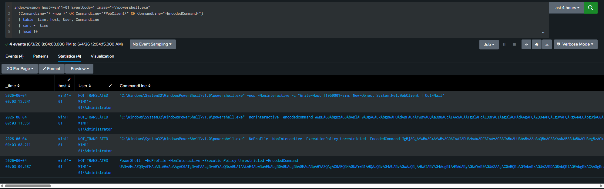
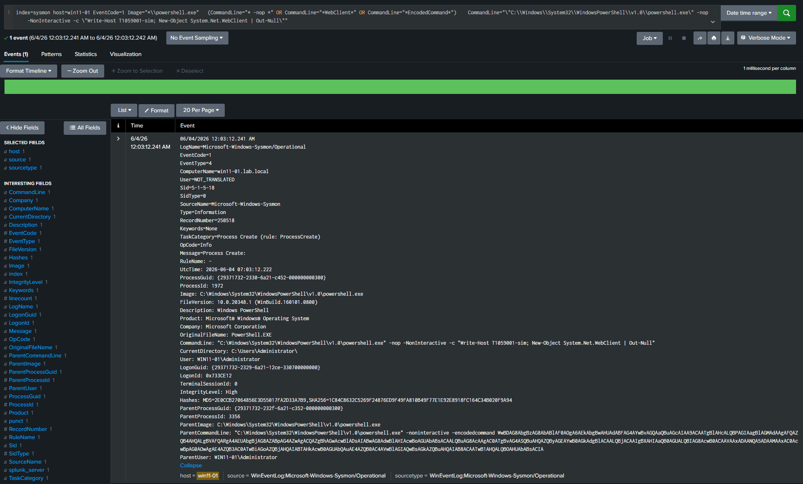

# T1059.001 — PowerShell

**MITRE ATT&CK:** [T1059.001](https://attack.mitre.org/techniques/T1059/001/)
**Tactic:** Execution
**Platforms:** Windows

---

## Description

Adversaries abuse PowerShell to execute commands, download payloads, and run code entirely in memory. PowerShell is trusted by Windows, signed by Microsoft, and present on every modern endpoint — making it a default tool for post-exploitation. Detection focuses on the characteristic flags and patterns that distinguish malicious invocations from routine administrative use: no-profile (`-nop`), execution policy bypass (`-exec bypass`), encoded commands (`-enc`/`-EncodedCommand`), and in-memory execution via `New-Object Net.WebClient` or `IEX`.

---

## Attack simulation

### Tools used

| Tool | Purpose |
|---|---|
| Ansible win_shell | Remote PowerShell execution on win11-01 via WinRM (simulates attacker with valid credentials) |
| CrackMapExec | SMB-based remote PowerShell execution (alternative path) |

### Steps to reproduce

1. Ensure lab prerequisites are met (see [detections/README.md](../README.md#lab-prerequisites)).
2. From webserv1, execute suspicious PowerShell remotely on win11-01:

```bash
ansible win11-01 -m ansible.windows.win_shell \
  -a 'powershell -nop -NonInteractive -c "Write-Host T1059001-sim; New-Object System.Net.WebClient | Out-Null"' \
  -e @ansible/group_vars/secrets.yml
```

3. See [attack.md](attack.md) for full simulation walkthrough and Splunk validation.

### Expected endpoint behavior

Sysmon fires Event ID 1 on win11-01 with:
- `Image`: `C:\Windows\System32\WindowsPowerShell\v1.0\powershell.exe`
- `CommandLine`: contains `-nop`, `-NonInteractive`, and `New-Object System.Net.WebClient`
- `IntegrityLevel`: High (elevated session)
- `ParentImage`: `powershell.exe` (the WinRM transport wrapper — itself encoded, which in a real attack represents the initial access stage)

---

## Data sources required

| Source | Splunk Index | Event IDs | Required config |
|---|---|---|---|
| Sysmon | `sysmon` | EventCode=1 (Process Create) | Sysmon installed with lab config |
| Windows PowerShell | `wineventlog` | EventCode=4104 (Script Block) | Enable via GPO: Computer Config → Admin Templates → Windows Components → PowerShell → Turn on Script Block Logging |

---

## Detection logic

```spl
index=sysmon EventCode=1
    (Image="*\\powershell.exe" OR Image="*\\pwsh.exe")
    (CommandLine="* -enc *" OR CommandLine="* -EncodedCommand *"
     OR CommandLine="* -exec bypass*" OR CommandLine="* -nop *"
     OR CommandLine="*IEX*" OR CommandLine="*Invoke-Expression*"
     OR CommandLine="*DownloadString*" OR CommandLine="*WebClient*")
| stats count min(_time) as first_seen max(_time) as last_seen values(CommandLine) as CommandLines by host, User
| where count > 0
| eval first_seen=strftime(first_seen,"%Y-%m-%d %H:%M:%S"), last_seen=strftime(last_seen,"%Y-%m-%d %H:%M:%S")
| table host, User, count, first_seen, last_seen, CommandLines
```

### Logic explanation

- **`EventCode=1`** — Sysmon Process Create; captures every new process with full command line.
- **`Image` filter** — Scope to PowerShell executables (both legacy `powershell.exe` and modern `pwsh.exe`).
- **`CommandLine` filters** — Match the most common attacker patterns: no-profile, encoded commands, policy bypass, and download cradles.
- **`stats count by host, User`** — A single match is enough to investigate; `count > 0` ensures every hit surfaces.

---

## False positive considerations

| Scenario | Likelihood | Tuning recommendation |
|---|---|---|
| Ansible / automation tools using `-EncodedCommand` | High in this lab | Whitelist by `ParentImage` (`wsmprovhost.exe` for WinRM) or known service account `User` values |
| SCCM / software deployment scripts | Medium | Whitelist known deployment `ParentImage` paths |
| IT admin one-liners | Low | Add known admin accounts to an exclusion lookup table |

---

## Recommended response

1. **Triage** — Check `User` against known admin accounts. A `ParentImage` of `winword.exe`, `outlook.exe`, or `wscript.exe` is high priority.
2. **Investigate** — Decode any Base64 in `CommandLine`. Pivot to EventCode=4104 (Script Block) for the decoded payload if script block logging is enabled.
3. **Escalate if** — Decoded command contains `Invoke-Mimikatz`, `Add-MpPreference -ExclusionPath`, or any download cradle pointing to an external host.
4. **Contain** — Isolate the host from the domain. Disable the user account if credential theft is suspected.

---

## References

- [MITRE ATT&CK T1059.001](https://attack.mitre.org/techniques/T1059/001/)
- [Atomic Red Team T1059.001](https://github.com/redcanaryco/atomic-red-team/blob/master/atomics/T1059.001/T1059.001.md)
- [Sysmon Event ID 1 — Process Create](https://www.ultimatewindowssecurity.com/securitylog/encyclopedia/event.aspx?eventid=90001)

---

## Screenshots

### Splunk search result



*Caption: Detection query returning PowerShell executions from win11-01 — direct simulation (`-nop -c "...WebClient..."`), encoded wrapper, and Ansible WinRM transport all flagged*

### Event detail



*Caption: Sysmon Event ID 1 on win11-01.lab.local — `powershell.exe -nop -NonInteractive -c "...WebClient..."` at High integrity under WIN11-01\Administrator, with encoded-command parent process*
