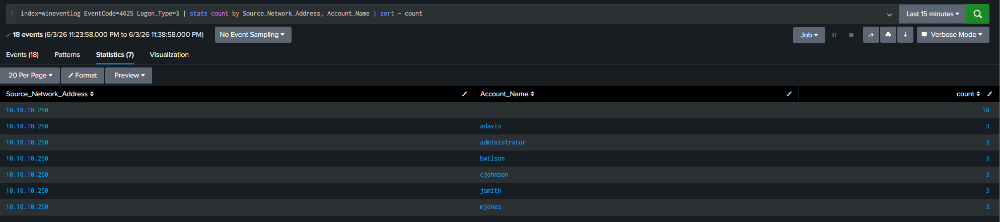
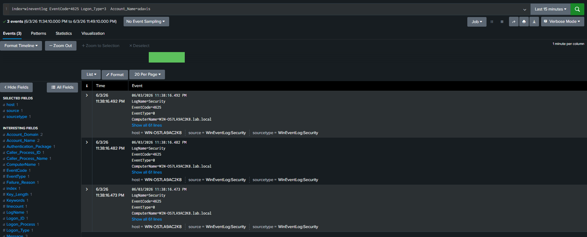

# T1078 — Valid Accounts (Password Spray)

**MITRE ATT&CK:** [T1078](https://attack.mitre.org/techniques/T1078/)
**Tactic:** Initial Access, Persistence
**Platforms:** Windows

---

## Description

Password spraying tries one or a few common passwords against many accounts, deliberately staying under per-account lockout thresholds. Against Active Directory, a spray generates a burst of Event ID 4625 (failed logon, Logon Type 3) from a single source IP across many usernames in a short window. The distinguishing signal is breadth — many accounts failing from one source rather than one account failing repeatedly.

---

## Attack simulation

### Tools used

| Tool | Purpose |
|---|---|
| CrackMapExec | SMB password spray from kali against dc01 |
| Atomic Red Team | Automated T1078 technique execution (optional) |

### Steps to reproduce

1. Ensure lab prerequisites are met (see [detections/README.md](../README.md#lab-prerequisites)).
2. From kali (10.10.10.250) against dc01 (10.10.10.10):

```bash
crackmapexec smb 10.10.10.10 \
  -u administrator jsmith mjones adavis bwilson cjohnson \
  -p 'Winter2024!' 'Spring2024!' 'Password1'
```

3. See [attack.md](attack.md) for full simulation walkthrough and expected CrackMapExec output.

### Expected endpoint behavior

dc01 logs 18 Event ID 4625 failures with Logon Type 3 and status `0xC000006D` (wrong password) from source IP 10.10.10.250 within seconds. All six accounts targeted in the spray appear in the failure log.

---

## Data sources required

| Source | Splunk Index | Event IDs | Required config |
|---|---|---|---|
| Windows Security Log | `wineventlog` | 4625 (failed logon) | Default — no extra config |
| Windows Security Log | `wineventlog` | 4624 (successful logon) | Default — pivot to confirm compromise |

---

## Detection logic

```spl
index=wineventlog EventCode=4625
    Logon_Type=3
    (Status="0xC000006D" OR Status="0xC000006A")
| bucket _time span=5m
| stats count dc(Account_Name) as unique_accounts values(Account_Name) as accounts
    by _time, Source_Network_Address, host
| where count > 10
| eval window=strftime(_time,"%Y-%m-%d %H:%M")
| table window, Source_Network_Address, host, count, unique_accounts, accounts
| sort - count
```

### Logic explanation

- **`EventCode=4625, Logon_Type=3`** — Network logon failures only; filters out interactive and service logon noise.
- **`Status` filter** — `0xC000006D` = wrong password; `0xC000006A` = wrong password (older format). Excludes disabled/expired account codes to reduce noise.
- **`bucket span=5m`** — Groups events into 5-minute windows to surface spray volume.
- **`where count > 10`** — More than 10 failures from one source in 5 minutes triggers the alert. Tune down for higher sensitivity in low-traffic environments.

---

## False positive considerations

| Scenario | Likelihood | Tuning recommendation |
|---|---|---|
| Misconfigured service account with stale password | Medium | Whitelist specific `Account_Name` values that are known service accounts |
| User locking themselves out on multiple devices | Low | Check if `Source_Network_Address` is the user's own workstation |
| Vulnerability scanner / security assessment | Low | Whitelist known scanner IP ranges |

---

## Recommended response

1. **Triage** — Confirm `Source_Network_Address` is not a known admin tool or scanner IP.
2. **Investigate** — Pivot to Event ID 4624 from the same source IP: a 4625 burst followed by a 4624 from the same source = confirmed credential success.
3. **Escalate if** — Any sprayed account shows a successful logon (4624) within the spray window, or if the source IP is external.
4. **Contain** — Block the source IP at the firewall. Reset passwords for all targeted accounts if a successful logon is confirmed.

---

## References

- [MITRE ATT&CK T1078](https://attack.mitre.org/techniques/T1078/)
- [Atomic Red Team T1078](https://github.com/redcanaryco/atomic-red-team/blob/master/atomics/T1078/T1078.md)
- [Windows Event ID 4625](https://www.ultimatewindowssecurity.com/securitylog/encyclopedia/event.aspx?eventid=4625)

---

## Screenshots

### Splunk search result



*Caption: 18 Event ID 4625 failures from 10.10.10.250 (Kali) against dc01 — 6 accounts sprayed with 3 passwords each in a single 5-minute window*

### Event detail



*Caption: Individual 4625 event showing Logon Type 3, source IP 10.10.10.250, and status 0xC000006D (wrong password)*
