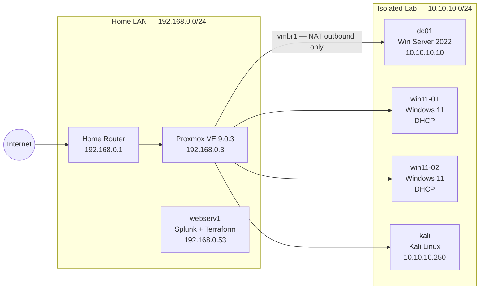
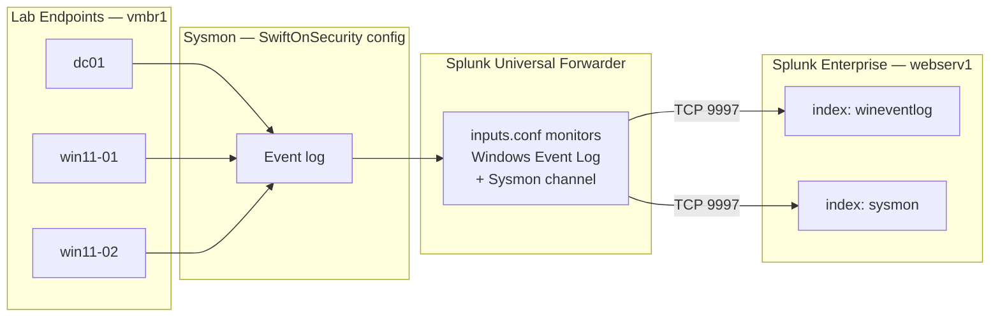

# Architecture

## Overview

This lab is a single-host Proxmox environment that models a small Active Directory domain under attack. The goal is to generate realistic Windows telemetry, ship it to Splunk, and build validated detection logic for five MITRE ATT&CK techniques. Everything is provisioned with Terraform and configured with Ansible so the lab can be rebuilt from scratch.

---

## Automation host rationale

**webserv1** (192.168.0.53, Ubuntu 24.04) serves as both the Terraform execution host and the Splunk SIEM. Co-locating these on one machine is a deliberate cost trade-off: the machine was already running, the Splunk Developer Personal License (10 GB/day) is more than sufficient for a four-endpoint lab, and the direct network path from webserv1 to the Proxmox API avoids any NAT complexity for Terraform's SSH-backed disk operations.

In a production environment these roles would be separated. For a portfolio lab, the consolidation is appropriate.

---

## Provider rationale

The [bpg/proxmox](https://registry.terraform.io/providers/bpg/proxmox/latest) provider (v0.106.x) was chosen over the older `telmate/proxmox` provider for three reasons:

1. **Active PVE 9.x support** — `telmate` has not kept pace with Proxmox API changes in recent major versions.
2. **Native cloud-init support** — `bpg/proxmox` exposes `initialization` blocks with `vendor_data_file_id`, `user_data_file_id`, and `user_account`, making the three-layer cloud-init pattern straightforward.
3. **SSH-backed disk operations** — importing cloud images into VM disks requires SSH access to the Proxmox host in addition to the REST API. The provider handles this transparently given an `ssh` block in the provider configuration.

---

## Cloud-init layering pattern

Every VM in this lab uses a three-layer cloud-init model. The layers are merged by cloud-init at first boot:

| Layer | Mechanism | Responsibility | Changes per VM? |
|---|---|---|---|
| **Platform baseline** | `vendor_data_file_id` → `vendor-base.yaml` | Installs `qemu-guest-agent`, enables the service | No — shared across all VMs |
| **VM identity** | `user_account` block | SSH public key, login username | Potentially (different users per OS) |
| **Role-specific config** | Additional `proxmox_virtual_environment_file` resource | VM-specific packages, config files | Yes — one per VM role |

The vendor-data layer exists because Ubuntu 24.04 cloud images do not include `qemu-guest-agent` pre-installed. Without the agent, Proxmox cannot query IP addresses or issue clean shutdown commands, and Terraform hangs waiting for the agent to report network interfaces after provisioning.

This pattern scales cleanly: adding something to the lab baseline (e.g., a monitoring agent) means editing one file in `cloud_init.tf`, not touching every VM resource.

---

## Network topology

**vmbr0** is the existing home LAN bridge. Lab VMs are not attached to vmbr0.

**vmbr1** is a new isolated bridge created in Session 2. Proxmox performs NAT from vmbr1 to vmbr0 for outbound internet access (package installs, Atomic Red Team downloads). There is no inbound routing from the internet to vmbr1.

---

## Logging pipeline

Sysmon is deployed using the [SwiftOnSecurity configuration](https://github.com/SwiftOnSecurity/sysmon-config), which provides broad coverage without excessive noise. The Splunk Universal Forwarder ships both the standard Windows Event Log and the dedicated Sysmon event channel to webserv1. Kali is not a log source — it is the attack machine.

---

## Security boundaries

- **vmbr1 is NAT outbound only.** Lab VMs can reach the internet for package installs but are not reachable from outside the home LAN. There is no port forwarding into the lab subnet.
- **Lab VMs are isolated from home LAN devices.** vmbr1 traffic does not route to other home LAN devices. The only home LAN machine that communicates with lab VMs is webserv1, via the Splunk forwarder connection on TCP 9997.
- **Splunk listens on 0.0.0.0:9997.** In this home lab context this is acceptable; in a production environment the listener would be bound to a specific interface.
- **No secrets in version control.** Proxmox API credentials are held in environment variables on webserv1. SSH private keys stay in `~/.ssh/`. The `.gitignore` excludes `*.tfvars` and `*.tfstate`.

---

## Scope and limitations

This lab is scoped as a v1 portfolio project, not a production SOC environment. The following are deliberate omissions, not gaps:

| Limitation | Notes |
|---|---|
| **Single-host, no HA** | All VMs run on one Proxmox node. A hardware failure takes down the entire lab. Acceptable for a personal portfolio project. |
| **Simulated attacks only** | All attack simulation uses [Atomic Red Team](https://github.com/redcanaryco/atomic-red-team) and manual techniques. No real malware is run. This is intentional — running live malware in a home lab introduces unacceptable risk to adjacent network devices. |
| **No C2 infrastructure** | There is no modeled command-and-control server (no Cobalt Strike, no Sliver). Techniques that require C2 beaconing are simulated at the endpoint level only. |
| **No cloud workload coverage** | All endpoints are on-premises Windows. AWS, Azure, and GCP workload detections are out of scope for this iteration. |
| **No email or web proxy logging** | The detection portfolio focuses on endpoint and network telemetry (Sysmon + Windows Event Log). Email gateway and proxy logs are not collected. |
| **Homelab-scale throughput** | Splunk is running on a Developer Personal License (10 GB/day ingestion cap). This is appropriate for four endpoints generating minimal traffic; it does not reflect production-scale tuning. |

A v2 iteration could add a dedicated C2 framework, cloud detection coverage, and proxy logging.
