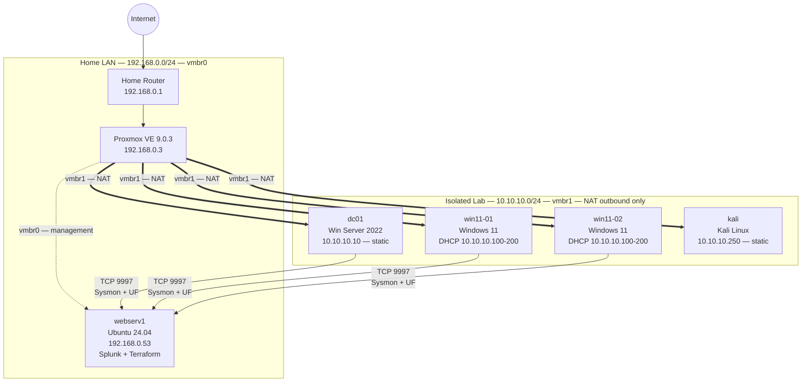

# Network Diagram

## Topology

---

## IP address table

| Host | Interface | Address | Assignment | Role |
|---|---|---|---|---|
| Home router | — | 192.168.0.1 | Static (ISP/router) | Default gateway, home LAN DHCP |
| Proxmox VE | vmbr0 | 192.168.0.3 | Static | Hypervisor management |
| Proxmox VE | vmbr1 | 10.10.10.1 | Static | Lab NAT gateway |
| webserv1 | eth0 | 192.168.0.53 | Static | Automation host, Splunk SIEM |
| dc01 | eth0 | 10.10.10.10 | Static (cloud-init) | Domain Controller, DNS, DHCP for lab subnet |
| win11-01 | eth0 | 10.10.10.100–200 | DHCP (from dc01) | Domain workstation |
| win11-02 | eth0 | 10.10.10.100–200 | DHCP (from dc01) | Domain workstation |
| kali | eth0 | 10.10.10.250 | Static (cloud-init) | Attacker machine |

---

## Bridge summary

| Bridge | Type | Subnet | Purpose | Internet access |
|---|---|---|---|---|
| vmbr0 | Linux bridge | 192.168.0.0/24 | Home LAN — management plane, webserv1 | Yes (via home router) |
| vmbr1 | Linux bridge + NAT | 10.10.10.0/24 | Isolated lab — all lab VMs | Outbound only (NAT via vmbr0) |
